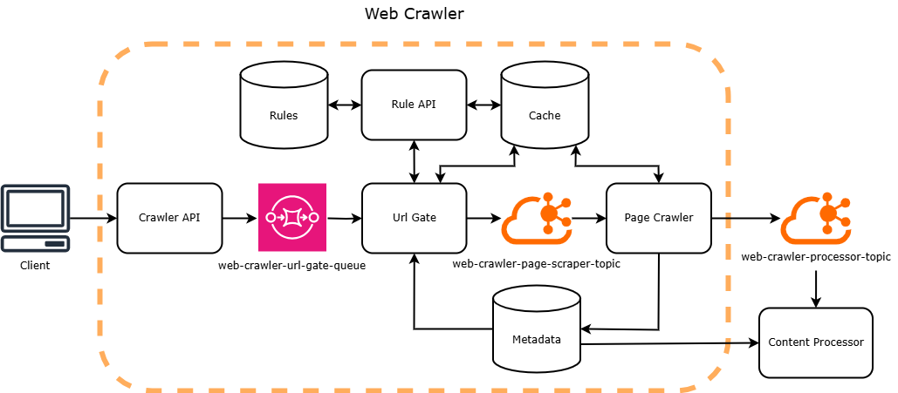

# url-gate

## Workflow

1. Reads from SQS Queue: Processes messages containing URLs for validation.
2. Checks Cache for Recent Crawl: Uses a 24-hour expiring cache to avoid redundant crawling. If found, stops further
   processing.
3. Check URL in Metadata: Sends conditional requests (using If-None-Match with ETag) to check for content changes.
   Skips re-crawling if content is unchanged.
4. Queries Rule API Service: Retrieves domain rules, including any custom rules for blocking or rate limiting.
5. Manages Domain Rate Limits: Checks a 1-minute expiring cache for active crawls on the domain. Reschedules if the
   threshold is exceeded; increments the counter if allowed.
6. Writes to Kafka Topic: Outputs messages with the URL and crawl permissions for further processing.
7. Send url with error description to dead-letter queue if any error occurs.

